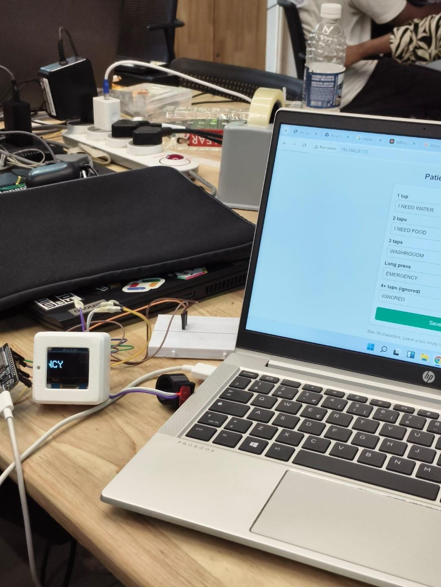

# Patient Call System

An ESP32-based call device for patients who can't easily speak or press multiple buttons. A single touch sensor reads tap patterns, shows the request on an OLED display, and **emails the caregiver** so help can come even from another room.

Built at the **Claude Community Calicut Impact Lab Hackathon**.

## How it works

| Gesture | Message (default, editable) | Email |
|---|---|---|
| 1 tap | WATER | Routine request |
| 2 taps | FOOD | Routine request |
| 3 taps | WASHROOM | Routine request |
| Long press | EMERGENCY | **URGENT**, high priority |
| 4+ taps | IGNORED | None |

- The request scrolls across the OLED so the patient can see it was registered.
- The caregiver gets an email with the request, time, location and Wi-Fi signal.
- Messages can be changed from a settings web page hosted by the ESP32 (its IP is shown on the OLED at boot) and are stored in flash.
- Emails send in a background task, retry on failure, and have a per-gesture cooldown to avoid flooding the inbox.

## Final product

The device in a 3D-printed case with the OLED, and the settings web page open on the laptop.

**Demo video:** [docs/images/demo.mp4](docs/images/demo.mp4)

## Components

<!-- Fill in the parts list. Add photos or a wiring diagram under docs/images/ -->

| Component | Quantity | Notes |
|---|---|---|
| ESP32 dev board | 1 | |
| Touch sensor module | 1 | Signal on GPIO 4 |
| SH1106 128x64 OLED (I2C) | 1 | SDA = GPIO 21, SCL = GPIO 22, address 0x3C |
| _add more_ | | |

### Wiring

<!-- Add a wiring diagram, e.g. docs/images/wiring.png -->

| Part | ESP32 pin |
|---|---|
| Touch sensor OUT | GPIO 4 |
| OLED SDA | GPIO 21 |
| OLED SCL | GPIO 22 |
| VCC / GND | 3V3 / GND |

## Setup

1. **Gmail sender account.** Create a dedicated Gmail account, turn on 2-Step Verification, then create an **App Password** at <https://myaccount.google.com/apppasswords>.
2. **Arduino IDE.**
   - Install the **esp32 by Espressif Systems** board package.
   - Install these libraries: **ESP Mail Client** (Mobizt), **Adafruit GFX Library**, **Adafruit SH110X**.
3. **Configure.** Open [esp32_patient_call/esp32_patient_call.ino](esp32_patient_call/esp32_patient_call.ino) and edit the settings block at the top: Wi-Fi, sender email and app password, caregiver email, patient name, location, timezone offset.
4. **Upload.** Select your ESP32 board and port, then upload. Open the Serial Monitor at 115200 baud to watch the log.
5. **Test.** Tap once, check the serial log for `Email: SENT`, then check the caregiver's inbox (and spam).

> Don't commit your real Wi-Fi password or Gmail app password. Keep them out of the repository.

## Notes and limits

- Email is not guaranteed to be instant. For life-critical use, add a second alert channel such as SMS or Telegram.
- Mark the sender address as "not spam" on the caregiver's side.
